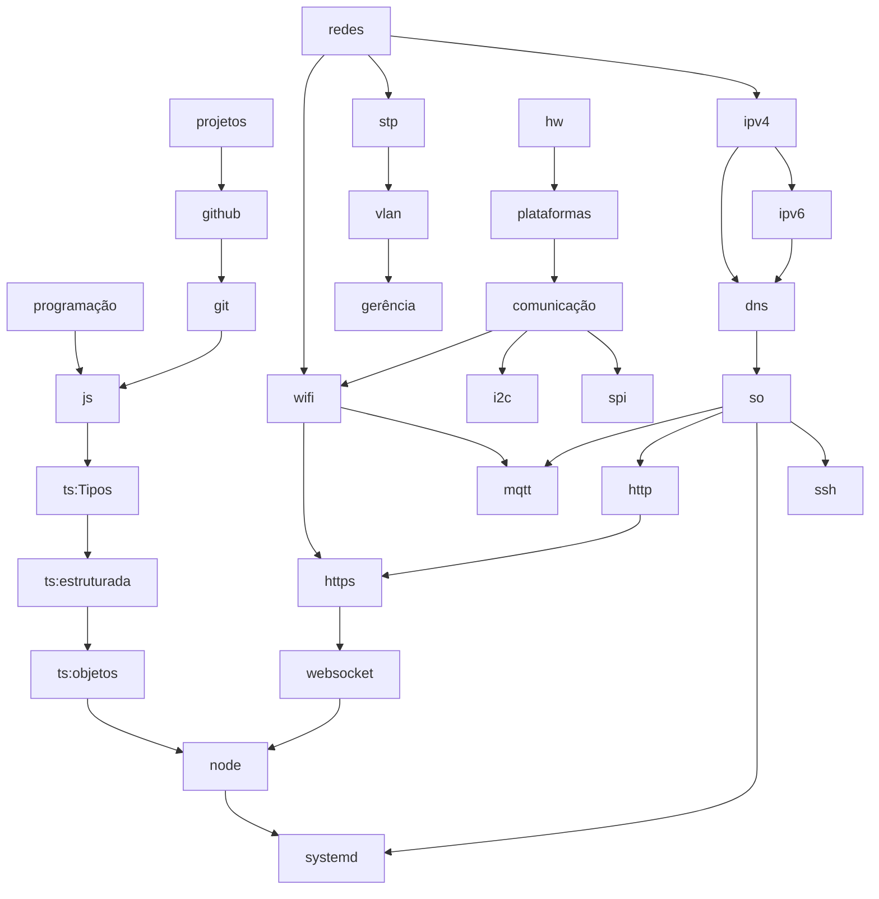

# 6080811-2026.1

Projeto da turma 6080811, semestre 2026.1:

- Celular proibido em aula, conforme [Lei 15.100/2025](https://www.planalto.gov.br/ccivil_03/_ato2023-2026/2025/lei/l15100.htm). Será usada uma cesta para depositar os celulares durante as aulas.
- Equipes em duplas.

## Fluxo de conteúdo

## Ferramentas

- [GitHub Education](https://github.com/education)
- [Canva Pro](https://www.canva.com/pt_br/pro/)
- [Gemini Pro](https://gemini.google.com/)
