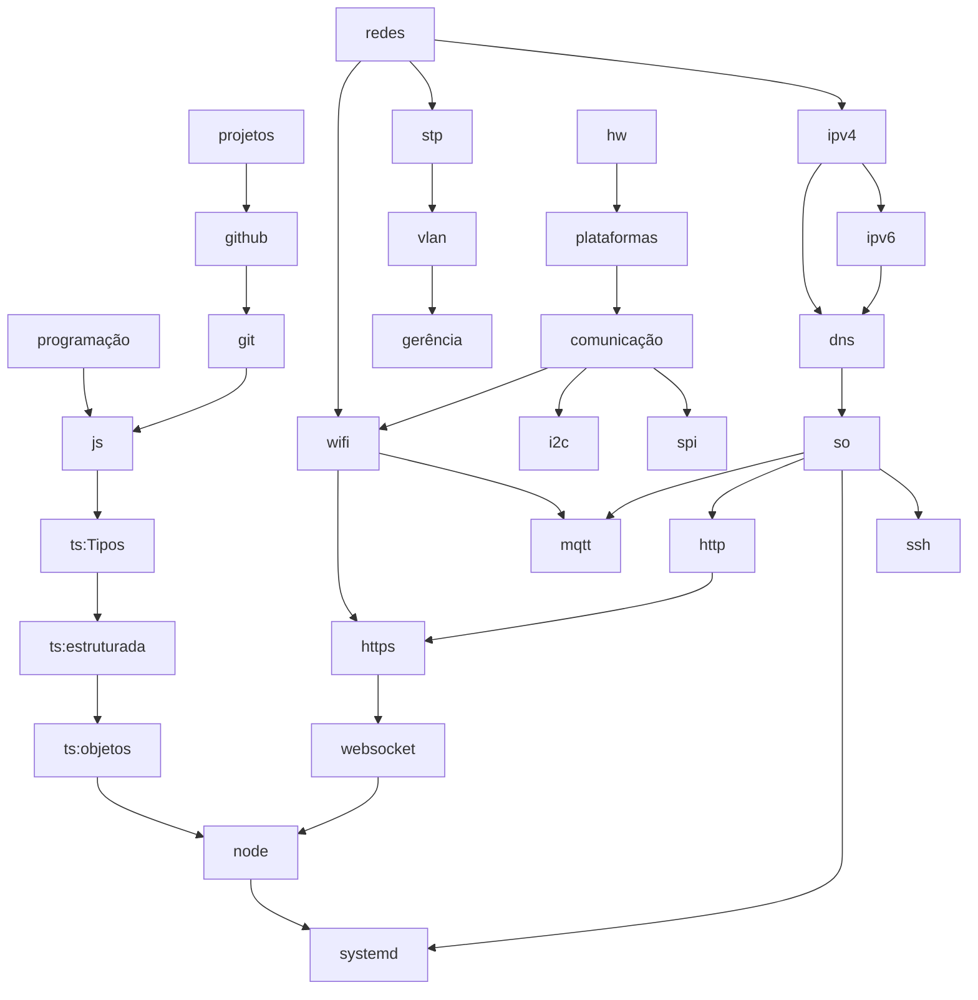

# 6080811-2026.1

Projeto da turma 6080811, semestre 2026.1:

- Celular proibido em aula, conforme [Lei 15.100/2025](https://www.planalto.gov.br/ccivil_03/_ato2023-2026/2025/lei/l15100.htm). Será usada uma cesta para depositar os celulares durante as aulas.
- Equipes em duplas.

## Fluxo de conteúdo

## Referências

Livros:

- *Game design*:
  - Theory of Fun for Game Design, de Raph Koster
  - The Art of Game Design: A Book of Lenses, de Jesse Schell
  - [Level Up! - um guia para o _design_ de grandes jogos](https://app.minhabiblioteca.com.br/reader/books/9788521207016/), de Scott Rogers.
  - Regras do jogo: fundamentos do design de jogos, de Katie Salen e Eric Zimmerman:
    - [volume 1](https://app.minhabiblioteca.com.br/reader/books/9788521206538/)
    - [volume 2](https://app.minhabiblioteca.com.br/reader/books/9788521206545/)
    - [volume 3](https://app.minhabiblioteca.com.br/reader/books/9788521206552/)
    - [volume 4](https://app.minhabiblioteca.com.br/reader/books/9788521206569/)
  - Designing Games: A Guide to Engineering Experiences, de Tynan Sylvester

- Ficção com temática espacial:

  - 2001: Uma Odisseia no Espaço, Arthur C. Clarke
  - A Cidade e as Estrelas, Arthur C. Clarke
  - A Mão Esquerda da Escuridão, Ursula K. le Guin
  - A Missão Encélado, William Q. Morris
  - Alpha Centauri, Isaac Asimov
  - Aniquilação / Autoridade / Aceitação, Jeff VanderMeer
  - As Crônicas Marcianas, Ray Bradbury
  - As Fontes do Paraíso, Arthur C. Clarke
  - Carbono Alterado, Richard K. Morgan
  - Cinco por Infinito, Esteban Maroto
  - Devoradores de Estrelas, Andy Weir
  - Duna / O Messias de Duna / Os Filhos de Duna, Frank Herbert
  - Encontro com Rama / O Enigma de Rama / Jardim de Rama / A Revelação de Rama, Arthur C. Clarke
  - Fundação / Fundação e Império / Segunda Fundação, Isaac Asimov
  - Guerra do Velho / Brigadas Fantasma / A Última Colônia, John Scalzi
  - Guerra dos Mundos, H. G. Wells
  - História da sua Vida e outros Contos, Ted Chiang
  - Hyperion, Dan Simmons
  - Justiça Ancilar, Ann Leckie
  - Leviatã Desperta, James S. A. Corey
  - Nove Amanhãs, Isaac Asimov
  - O Eternauta, Héctor Germán Oesterheld e Francisco Solano López
  - O Fim da Eternidade, Isaac Asimov
  - O Fim da Infância, Arthur C. Clarke
  - O Planeta dos Macacos, Pierre Boulle
  - O Problema dos Três Corpos / Floresta Sombria / O Fim da Morte, Cixin Liu
  - Os Despossuídos, Ursula K. le Guin
  - Os Próprios Deuses, Isaac Asimov
  - Perdido em Marte, Andy Weir
  - Piquenique na Estrada, Arkady Strugatsky e Boris Strugatsky
  - Realidades Adaptadas, coletânea de contos de Philip Dick
  - Red Mars / Green Mars / Blue Mars, Stanley K. Robinson 
  - Redshirts, John Scalzi
  - Shangri-La, Mathieu Bablet
  - Solaris, Stanislaw Lem
  - Tropas Estelares, Robert Heinlein
  - Um Estranho numa Terra Estranha, Robert Heinlein
  - Uma Princesa de Marte, Edgar Rice Burroughs

Vídeos:

- [GDLK](https://www.netflix.com/br/title/81019087)
- [Game Makers' Toolkit](https://www.youtube.com/@GMTK)

Modelos:

- [*Game design template*](/gdd.md)

Ferramentas

- [GitHub Education](https://github.com/education)
- [Canva Pro](https://www.canva.com/pt_br/pro/)
- [Gemini Pro](https://gemini.google.com/)

## Jogos

| Jogo | 1 |
|-|-|
| [Abissal](https://github.com/starlootgames/Abissal) | 6 |
| [Astronautica](https://github.com/kepler-442c/astronautica) | 6 |
| [Galacto](https://github.com/le-clar/Galacto) | 0 (sem receita) |
| [Horizonte de Eventos](https://github.com/gargantua-games/horizonte-de-eventos) | 0 (sem receita) |
| [Hyperdrive](https://github.com/hyperdrivecreators/hyperdrive) | 0 (sem acesso) |
| [Interstelar](http://github.com/teknoifsc/interestelar) | 6 |
| [The Legend of Marquinhos](https://github.com/calabresogames/thelegendofmarquinhos) | 0 (sem receita) |
| [Noé](https://github.com/jc-company-ifsc/Noe) | 0 (sem acesso) |
| [Sentinela](https://github.com/malugio/Sentinela) | 6 |
| [Space Gun](https://github.com/space-000/space-gun) | 0 (sem acesso) |
| [Space IFSC](https://github.com/doisdevseumsonho/spaceifsc) | 6 |
| [Space War](https://github.com/gremiogames/space-war) | 6 |
| [Star Rush](http://github.com/pinkmilkway/Star-Rush) | 6 |
