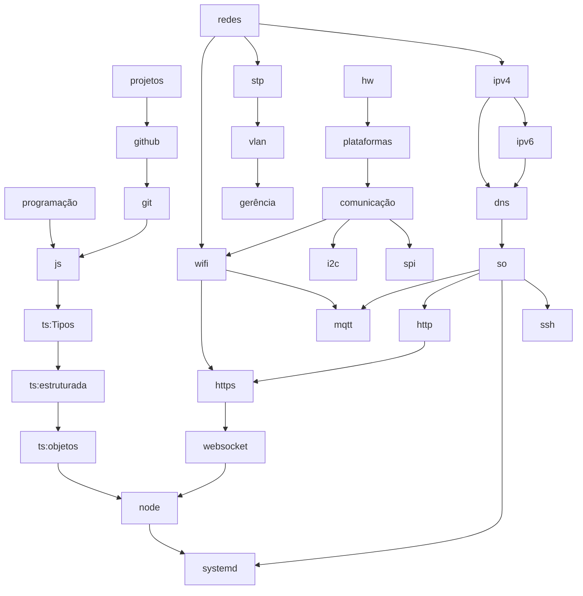

# 6080811-2026.1

```mermaid
flowchart TD

programação --> js
projetos --> github
redes --> ipv4
github --> git
git --> js
js --> ts:Tipos
ts:Tipos --> ts:estruturada
ts:estruturada --> ts:objetos
ts:objetos --> node
ipv4 --> ipv6
ipv4 --> dns
ipv6 --> dns
dns --> so
so --> ssh
so --> systemd
node --> systemd
so --> http
http --> https
websocket --> node
redes --> stp
stp --> vlan
vlan --> gerência
redes --> wifi
so --> mqtt
hw --> plataformas
plataformas --> comunicação
comunicação --> spi
comunicação --> i2c
comunicação --> wifi
wifi --> mqtt
wifi --> https
https --> websocket
```
